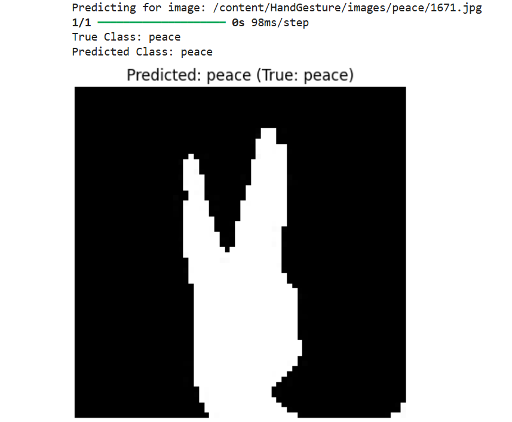

#  Hand Gesture Recognition using CNN

##  Overview

This project implements a **Convolutional Neural Network (CNN)** for automatic **hand gesture classification** using grayscale images. It demonstrates a complete deep learning workflow including **data exploration, preprocessing, model development, training, evaluation, and prediction**.

The model is trained to recognize **10 different hand gestures** with high accuracy.

---


##  Dataset Details

* **Dataset Type:** Image Classification (Hand Gestures)
* **Directory:** `/content/HandGesture/images`
* **Total Classes:** 10

[Download dataset](https://drive.google.com/file/d/13ATPyKPsXWIgt6uAAYIQMWOvPkipYd1k/view?usp=sharing)

**Classes:**

```
rock, thumbs, up, fingers_crossed, scissor, 
rock_on, peace, call_me, okay, paper
```

* **Images per Class:** ~500–540
* **Total Dataset Size:** 5000+ images
* **Original Image Size:** 240 × 195
* **Format:** Grayscale

---

##  Exploratory Data Analysis (EDA)

* Verified dataset structure and class distribution
* Counted images per class
* Confirmed:

  * Uniform image size
  * Consistent grayscale format

 Result: Dataset is clean and well-balanced

---

##  Data Preprocessing

To prepare the data for CNN:

* Resized images → **64 × 64**
* Normalized pixel values → **[0,1]**
* Maintained grayscale format
* Added channel dimension → `(64, 64, 1)`

 Ensures compatibility with CNN input requirements

---

##  Train-Test Split

* **Training Data:** 80%
* **Testing Data:** 20%
* Used:

  * `random_state = 42`
  * `stratified sampling` (balanced class distribution)

---

##  Model Architecture

A **Sequential CNN model** is designed using TensorFlow/Keras:

* Conv2D (32 filters) + ReLU
* MaxPooling2D
* Conv2D (64 filters) + ReLU
* MaxPooling2D
* Conv2D (128 filters) + ReLU
* MaxPooling2D
* Flatten Layer
* Dense Layer (128 neurons, ReLU)
* Output Layer (10 neurons, Softmax)

 Designed for efficient feature extraction and classification

---

##  Model Training

* **Optimizer:** Adam
* **Loss Function:** Sparse Categorical Crossentropy
* **Metric:** Accuracy
* **Epochs:** 10
* **Batch Size:** 32

 **Validation Accuracy Achieved:** ~97.24%

---

##  Model Saving

The trained model is saved for future use:

```
gesture_model.keras
```

---

##  Prediction

* Random image selected from dataset
* Preprocessed using same pipeline
* Model predicts gesture class

**Output includes:**

* True Label
* Predicted Label
* Image Visualization




##  Future Enhancements

* Real-time gesture recognition (webcam integration)
* Data augmentation for robustness
* Model deployment (Web / Mobile App)
* Hyperparameter tuning for further improvement

---

##  Requirements

* Python
* TensorFlow / Keras
* NumPy
* OpenCV
* Matplotlib


This project is developed as a practical implementation of **Deep Learning (CNN)** for image classification tasks.

---

## Author: Saman Tarique

